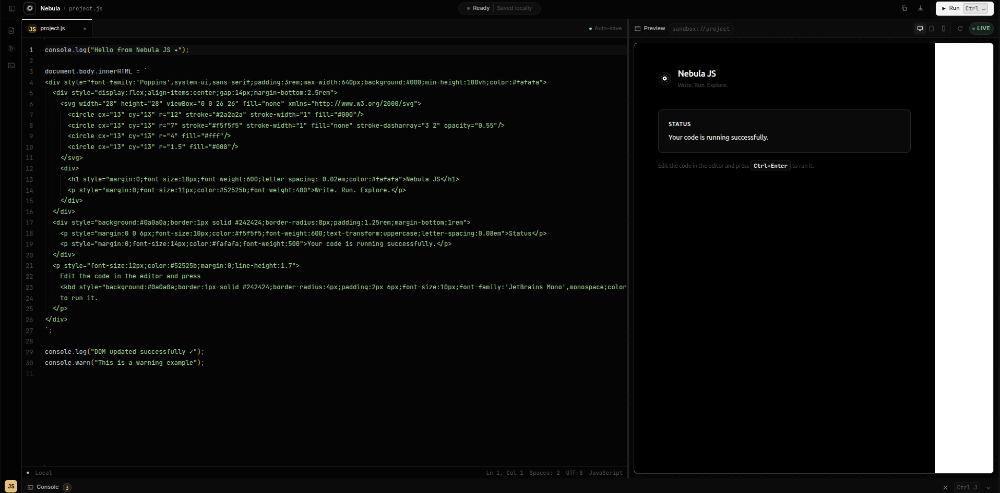

<p align="center">
  
</p>

<h1 align="center">Nebula Editor</h1>

<p align="center">
  Un playground de JavaScript rápido, oscuro y sin distracciones.<br />
  <code>Write.</code> <code>Run.</code> <code>Explore.</code>
</p>

<p align="center">
  
  
  
  
</p>

<p align="center">
  
</p>

## `> about`

Nebula permite escribir y ejecutar JavaScript directamente en el navegador. Incluye editor profesional, preview aislada y consola integrada en una interfaz inspirada en Zed.

## `> features`

- Monaco Editor con autocompletado, formato y diagnósticos.
- Ejecución segura dentro de un sandbox.
- Preview adaptable a escritorio, tablet y móvil.
- Consola con filtros para logs, warnings y errores.
- Fuente y tamaño del editor configurables.
- Guardado automático de código y preferencias en `localStorage`.
- Copia y descarga rápida del archivo `project.js`.

## `> shortcuts`

| Acción | Atajo |
| --- | --- |
| Ejecutar código | `Ctrl/Cmd + Enter` |
| Formatear documento | `Ctrl/Cmd + S` |
| Mostrar u ocultar consola | `Ctrl/Cmd + J` |

## `> run locally`

```bash
git clone https://github.com/lenithb/nebula-editor.git
cd nebula-editor
npm install
npm run dev
```

Para generar la versión de producción:

```bash
npm run build
```

## `> next`

- Temas completamente personalizables.
- Soporte para múltiples archivos.
- Sincronización y colaboración.

---

<p align="center">
  Hecho con React, TypeScript y Monaco Editor.
</p>
